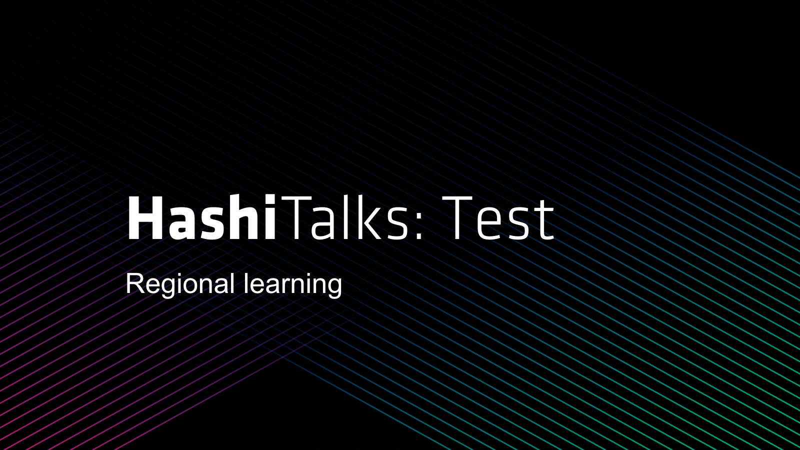

# Picasso templates

This repository holds [picasso](https://github.com/eveld/picasso) templates that
can be used to generate image assets. Picasso is a tool that can take a template
and data, and generate images from them. The templates that Picasso uses are
written in HCL (HashiCorp Configuration Language) and define the input,
output and design of the resulting image.

Some of these templates might require additional assets to be copied
into this repository for them to work. Due to licenses for those
assets, they are not included in this repository.

> Note:  The paths in the templates are computed from the folder
the binary is run in. This means that a template that refers to `images/background.png`
and is executed with the command `picasso generate -t hashitalks/regional/banner.hcl`
will look for the background at `$PWD/images/background.png`.

## Install Picasso

1. Download the binary for your operating system located at
   [Picasso's releases](https://github.com/eveld/picasso/releases).

1. Unzip the binary using your command line.
   ```shell
   unzip picasso_${OS}${ARCH}.zip
   ```

1. Make sure to change the permissions it is executable.
   ```shell
   chmod +x picasso
   ```

1. Copy the `picasso` binary to your `/usr/local/bin`.
   ```shell
   $ cp picasso /usr/local/bin
   ```

1. You can verify that you've installed it by running `picasso` in your command line.
   ```shell
   picasso
   ```
## Generate your first assets for a regional HashiTalks

Let's say you want to generate assets for `HashiTalks: Test`. You need the following
images:

- A banner for Marketo (for sending emails)
- Social graphics (Twitter and LinkedIn share cards)

We have some templates created for you. You can use these to generate a banner
and social graphics for your regional HashiTalks.

1. Reach out to the HashiCorp Community team to retrieve the background and
   font assets. They will send you a compressed file named `picasso_assets.zip`.

1. Download this repository.
   ```shell
   git clone https://github.com/eveld/picasso-templates.git
   ```

1. Change folder into the repository.
   ```shell
   cd picasso-templates
   ```

1. Unzip the `picasso_assets.zip`.

1. Copy the `images/` and `fonts/` folders to this repository.

1. Generate a banner using `picasso`. You need to pass some information.
   Use the template in `hashitalks/regional/banner.hcl` and output
   the image to `banner.png`. You also need to specify the regional edition
   of HashiTalks by setting the `edition` variable. In our example,
   we set `edition="Test"`.
   ```shell
   picasso generate \
        -t hashitalks/regional/banner.hcl \
        -o banner.png \
        --var edition="Test"
   ```

1. You should now have a file named `banner.png` with `HashiTalks: Test`.
   

1. You can generate a social media card with a similar command.
   Use the `card.hcl` template, output the image
   to `card.png`, and add a tagline.
   ```shell
   picasso generate \
        -t hashitalks/regional/card.hcl \
        -o card.png \
        --var edition="Test" \
        --var tagline="Regional learning"
   ```

1. You should now have a file named `card.png` with `HashiTalks: Test` and the tagline, `Regional learning`.
   

## Generate a speaker card

After you've scheduled speakers for HashiTalks, you can create
speaker cards. These can be used for speakers to promote their talks
over social media and for transition slides.

1. Make sure you have a folder named `Hashitalks` with folders called:
   * `fonts/`
   * `images/`
   * `picasso-templates/`

1. In the `HashiTalks` folder, make a new folder called `speakers`.

1. Download all of the speaker photos into the `speakers` folder.

1. Crop all photos to be 400 x 397 pixels. This ensures that the top and bottom of the photo
   line up with the top and bottom of the text.

1. Create a comma-separate value file with the edition, speaker, title,
   photo, date, and URL.
   * Headings must be __lower case__.
   * Make sure the photo uses the correct file name of the photo in the `speakers` folder.
   * For example, your CSV file might look like below:
      ```csv
      edition,speaker,title,photo,date,url
      Test,Cookie Monster,DevOps is like a Cookie,speakers/cookie.jpg,January 1st 2021,hashi.co/hashitalks
      ```

1. Save and download the file as `hashitalks.csv` in the `HashiTalks` folder. The `HashiTalks`
   folder should now contain the following:
   * `hashitalks.csv` - CSV file with speaker names, titles, and photos
   * `speakers/` - folder with all of the original speaker photos, cropped to 400x397
   * `fonts/` - folder with special fonts
   * `images/` - folder with background images and logos
   * `picasso-templates/` - folder with all of the templates.

1. Open a terminal and navigate to the `HashiTalks` folder.

1. Run `picasso` to generate the speaker cards. It uses the template
   for a speaker card with 1 line and outputs all cards to the `HashiTalks` folder.
   ```shell
   $ picasso generate \
        -t hashitalks/regional/speaker_1line.hcl \
        --csv hashitalks.csv \
        -o .
   ```

1. You should now have many files named `output-<some id>.png` for the speaker.
   For multiple speakers, each file will have a unique ID.
   